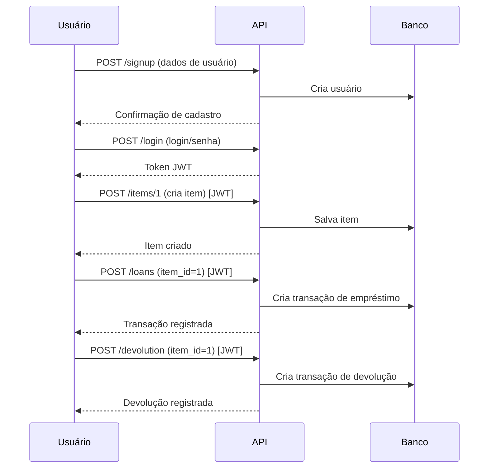

# 📦 Projeto Almoxarifado - Documentação

Este projeto é uma API RESTful desenvolvida em Flask para gerenciar usuários, itens e transações de empréstimo/devolução, com autenticação JWT e persistência em banco de dados SQLite via SQLAlchemy.

## Resumo

- API para cadastrar usuários, gerenciar itens e registrar empréstimos/devoluções.
- Autenticação JWT com blacklist para logout seguro.
- Banco SQLite via SQLAlchemy; consultas diretas para listagens com filtros.
- Principais recursos: Itens, Usuários, Transações de Empréstimo e Devolução.

## Notas sobre módulos e arquivos

- app.py: Inicializa Flask, JWT, rotas e lifecycle; cria tabelas antes das requisições.
- sql_alchemy.py: Provedor SQLAlchemy (data) para integração ORM.
- blacklist.py: Estrutura em memória para tokens JWT revogados.
- bool_format.py: Conversão robusta de string para booleano, com validação.
- date.py: Utilitário para gerar timestamp formatado dd/mm/yyyy HH:MM:SS.
- models/user_models.py: Modelo UserModel; CRUD e buscas por id/login.
- models/item_models.py: Modelo ItemModel; CRUD, dono, disponibilidade e data.
- models/transaction_models.py: Modelo TransactionModel; empréstimos e devoluções.
- resourcers/user_resourcers.py: Endpoints de usuário, login/logout JWT.
- resourcers/item_resources.py: Endpoints de itens com filtros e CRUD.
- resourcers/transaction_resourcers.py: Endpoints de listagem, empréstimos e devoluções.
- __init__.py e ___init___.py: Inicializadores de pacote vazios.
- *.pyc: Arquivos compilados do Python, gerados automaticamente.

---

## Visão Geral da Arquitetura

A aplicação está organizada em módulos para manipulação de itens, usuários e transações, além de recursos de autenticação e utilitários. Abaixo, um resumo textual da estrutura para leitura rápida.

- Entidades: Users, Items, Transactions.
- Relações: Users possuem Items; Transactions ligam Items entre usuários (from_user → to_user).
- Campos chave: chaves primárias por entidade, datas formatadas e disponibilidade do item.

---

## 📁 `app.py`

Arquivo principal que inicializa a aplicação Flask e seus recursos REST.

### Funcionalidades

- Configura e inicializa banco de dados SQLite.
- Registra recursos REST (itens, usuários, transações).
- Gerencia autenticação e blacklist de tokens JWT.
- Cria as tabelas automaticamente antes de cada requisição.

### Principais Trechos

```python
app = Flask(__name__)
app.config['SQLALCHEMY_DATABASE_URI'] = 'sqlite:///data.db'
app.config['JWT_SECRET_KEY'] = 'Secret'
app.config['JWT_BLACK_LIST_ENABLED'] = True

api = Api(app)
jwt = JWTManager(app)
```

### Observações

- Função `@app.before_request` garante que as tabelas estejam criadas.
- Função `@jwt.token_in_blocklist_loader` verifica se o token JWT está revogado.

---

## 🗄️ `sql_alchemy.py`

Gerencia a conexão e manipulação do banco de dados com SQLAlchemy para uso com Flask.

```python
from flask_sqlalchemy import SQLAlchemy
data = SQLAlchemy()
```

---

## 🔑 `blacklist.py`

Gerencia tokens JWT revogados (logout):

```python
BLACKLIST = set()
```

---

## 🧩 Modelos de Dados

### `user_models.py`

Define o modelo de usuário.

- **`UserModel`**: Representa um usuário, com campos:
  - `user_id`, `username`, `login`, `password`
- Relacionamentos: Transações enviadas e recebidas.
- Métodos: busca por ID, busca por login, salvar, atualizar, deletar.

```python
class UserModel(data.Model):
    __tablename__ = 'users'
    user_id = ...
    ...
    def json(self):
        return {
            'user_id': self.user_id,
            'username': self.username,
            'login': self.login
        }
```

### `item_models.py`

Modelo para itens.

- **`ItemModel`**: item cadastrado no sistema.
  - Campos: `item_id`, `description`, `is_available`, `date`, `owner_id`
  - Métodos: busca, salvar, atualizar, deletar.

### `transaction_models.py`

Modelo para transações de empréstimo/devolução.

- **`TransactionModel`**: registra transferências de itens entre usuários.
  - Campos: `transaction_id`, `item_id`, `from_user_id`, `to_user_id`, `is_available`, `date`
  - Métodos: salvar, atualizar, remover referência de usuário em transações ao deletar usuário.

---

## 💡 Utilitários

### `bool_format.py`

Converte strings para booleanos, com tratamento de erros:

```python
def str_to_bool(value):
    ...
```

### `date.py`

Classe estática para formatar data/hora no padrão brasileiro:

```python
class Time(datetime):
    @staticmethod
    def register_time():
        ...
```

---

## 🌐 Endpoints REST e Recursos

A seguir, os endpoints da API documentados com exemplos de uso e detalhes de entrada/saída.

### 🔹 Itens (`item_resources.py`)

#### Listagem de Itens

```api
{
    "title": "Listar Itens",
    "description": "Retorna uma lista de itens com filtros opcionais",
    "method": "GET",
    "baseUrl": "http://localhost:5000",
    "endpoint": "/items",
    "headers": [],
    "queryParams": [
        { "key": "description", "value": "Descrição do item", "required": false },
        { "key": "is_available", "value": "Disponibilidade (true/false)", "required": false },
        { "key": "owner_id", "value": "ID do proprietário", "required": false },
        { "key": "limit", "value": "Limite de resultados", "required": false },
        { "key": "offset", "value": "Offset para paginação", "required": false }
    ],
    "pathParams": [],
    "bodyType": "none",
    "requestBody": "",
    "responses": {
        "200": {
            "description": "Lista de itens",
            "body": "{ \"items\": [ { \"item_id\": 1, \"description\": \"Livro\", \"is_available\": true, \"date\": \"07/06/2025 14:30:25\", \"owner_id\": 2 } ] }"
        }
    }
}
```

#### Obter Item Específico

```api
{
    "title": "Obter Item",
    "description": "Busca um item pelo ID",
    "method": "GET",
    "baseUrl": "http://localhost:5000",
    "endpoint": "/items/{item_id}",
    "headers": [],
    "pathParams": [
        { "key": "item_id", "value": "ID do item", "required": true }
    ],
    "bodyType": "none",
    "requestBody": "",
    "responses": {
        "200": {
            "description": "Item encontrado",
            "body": "{ \"item_id\": 1, \"description\": \"Livro\", \"is_available\": true, \"date\": \"...\", \"owner_id\": 2 }"
        },
        "404": {
            "description": "Item não encontrado",
            "body": "{ \"message\": \"Item not found.\" }"
        }
    }
}
```

#### Criar Novo Item

```api
{
    "title": "Criar Item",
    "description": "Cadastra um novo item no inventário do usuário autenticado",
    "method": "POST",
    "baseUrl": "http://localhost:5000",
    "endpoint": "/items/{item_id}",
    "headers": [
        {"key": "Authorization", "value": "Bearer <token>", "required": true}
    ],
    "pathParams": [
        { "key": "item_id", "value": "ID do item", "required": true }
    ],
    "bodyType": "json",
    "requestBody": "{ \"description\": \"Livro\", \"is_available\": true }",
    "responses": {
        "201": {
            "description": "Item criado",
            "body": "{ \"item_id\": 1, \"description\": \"Livro\", \"is_available\": true, \"date\": \"...\", \"owner_id\": 2 }"
        },
        "400": {
            "description": "Item já existe",
            "body": "{ \"message\": \"Item id'1' already exists.\" }"
        },
        "500": {
            "description": "Erro interno",
            "body": "{ \"message\": \"An internal error ocurred trying to save item.\" }"
        }
    }
}
```

#### Atualizar Item

```api
{
    "title": "Atualizar Item",
    "description": "Atualiza as informações de um item, desde que seja do usuário autenticado",
    "method": "PUT",
    "baseUrl": "http://localhost:5000",
    "endpoint": "/items/{item_id}",
    "headers": [
        {"key": "Authorization", "value": "Bearer <token>", "required": true}
    ],
    "pathParams": [
        { "key": "item_id", "value": "ID do item", "required": true }
    ],
    "bodyType": "json",
    "requestBody": "{ \"description\": \"Novo livro\", \"is_available\": false }",
    "responses": {
        "200": {
            "description": "Item atualizado",
            "body": "{ \"item_id\": 1, \"description\": \"Novo livro\", \"is_available\": false, \"date\": \"...\", \"owner_id\": 2 }"
        },
        "403": {
            "description": "Acesso negado",
            "body": "{ \"message\": \"You are not allowed to update this item.\" }"
        },
        "404": {
            "description": "Item não encontrado",
            "body": "{ \"message\": \"Item not found\" }"
        }
    }
}
```

#### Deletar Item

```api
{
    "title": "Deletar Item",
    "description": "Remove um item do inventário (apenas se for do usuário autenticado)",
    "method": "DELETE",
    "baseUrl": "http://localhost:5000",
    "endpoint": "/items/{item_id}",
    "headers": [
        {"key": "Authorization", "value": "Bearer <token>", "required": true}
    ],
    "pathParams": [
        { "key": "item_id", "value": "ID do item", "required": true }
    ],
    "bodyType": "none",
    "requestBody": "",
    "responses": {
        "200": {
            "description": "Item removido",
            "body": "{ \"message\": \"Item deleted.\" }"
        },
        "400": {
            "description": "Item não encontrado",
            "body": "{ \"message\": \"Item not found\" }"
        },
        "403": {
            "description": "Acesso negado",
            "body": "{ \"message\": \"You are not allowed to delete this item.\" }"
        },
        "500": {
            "description": "Erro interno",
            "body": "{ \"message\": \"An internal error ocurred trying to save item.\" }"
        }
    }
}
```

---

### 🔹 Usuários (`user_resourcers.py`)

#### Obter Usuário

```api
{
    "title": "Obter Usuário",
    "description": "Busca um usuário pelo seu user_id",
    "method": "GET",
    "baseUrl": "http://localhost:5000",
    "endpoint": "/users/{user_id}",
    "headers": [],
    "pathParams": [
        { "key": "user_id", "value": "ID do usuário", "required": true }
    ],
    "bodyType": "none",
    "responses": {
        "200": {
            "description": "Usuário encontrado",
            "body": "{ \"user_id\": 1, \"username\": \"joao\", \"login\": \"joao@email.com\" }"
        },
        "404": {
            "description": "Usuário não encontrado",
            "body": "{ \"message\": \"User not found.\" }"
        }
    }
}
```

#### Registrar Usuário

```api
{
    "title": "Registrar Usuário",
    "description": "Cria um novo usuário",
    "method": "POST",
    "baseUrl": "http://localhost:5000",
    "endpoint": "/signup",
    "headers": [],
    "bodyType": "json",
    "requestBody": "{ \"login\": \"joao@email.com\", \"username\": \"joao\", \"password\": \"123456\" }",
    "responses": {
        "201": {
            "description": "Usuário criado",
            "body": "{ \"message\": \"User created successfully!\" }"
        },
        "400": {
            "description": "Login já existe",
            "body": "{ \"message\": \"The login 'joao@email.com' already exists.\" }"
        },
        "500": {
            "description": "Erro interno",
            "body": "{ \"message\": \"An internal error ocurred trying to create user.\" }"
        }
    }
}
```

#### Login de Usuário

```api
{
    "title": "Login de Usuário",
    "description": "Autentica o usuário e retorna um token JWT",
    "method": "POST",
    "baseUrl": "http://localhost:5000",
    "endpoint": "/login",
    "headers": [],
    "bodyType": "json",
    "requestBody": "{ \"login\": \"joao@email.com\", \"password\": \"123456\" }",
    "responses": {
        "200": {
            "description": "Token de acesso",
            "body": "{ \"token_accessed\": \"<jwt_token>\" }"
        },
        "401": {
            "description": "Credenciais inválidas",
            "body": "{ \"message\": \"The username or password is incorrect.\" }"
        }
    }
}
```

#### Deletar Usuário

```api
{
    "title": "Deletar Usuário",
    "description": "Remove o usuário autenticado e suas transações",
    "method": "DELETE",
    "baseUrl": "http://localhost:5000",
    "endpoint": "/users/{user_id}",
    "headers": [
        { "key": "Authorization", "value": "Bearer <token>", "required": true }
    ],
    "pathParams": [
        { "key": "user_id", "value": "ID do usuário", "required": true }
    ],
    "bodyType": "none",
    "responses": {
        "200": {
            "description": "Usuário deletado",
            "body": "{ \"message\": \"user deleted successfully.\" }"
        },
        "403": {
            "description": "Não é permitido deletar outro usuário",
            "body": "{ \"message\": \"You can not delete other users\" }"
        },
        "404": {
            "description": "Usuário não encontrado",
            "body": "{ \"message\": \"User not found\" }"
        },
        "500": {
            "description": "Erro interno",
            "body": "{ \"message\": \"An internal error ocurred trying to delete user.\" }"
        }
    }
}
```

#### Logout do Usuário

```api
{
    "title": "Logout",
    "description": "Realiza o logout do usuário, invalidando o token JWT",
    "method": "POST",
    "baseUrl": "http://localhost:5000",
    "endpoint": "/logout",
    "headers": [
        { "key": "Authorization", "value": "Bearer <token>", "required": true }
    ],
    "bodyType": "none",
    "responses": {
        "200": {
            "description": "Logout realizado",
            "body": "{ \"message\": \"Logged out sucessfully!\" }"
        }
    }
}
```

---

### 🔹 Transações (`transaction_resourcers.py`)

#### Listar Transações

```api
{
    "title": "Listar Transações",
    "description": "Retorna todas as transações, com filtros opcionais e paginação",
    "method": "GET",
    "baseUrl": "http://localhost:5000",
    "endpoint": "/transactions",
    "headers": [],
    "queryParams": [
        { "key": "transaction_id", "value": "ID da transação", "required": false },
        { "key": "item_id", "value": "ID do item", "required": false },
        { "key": "from_user_id", "value": "ID do remetente", "required": false },
        { "key": "to_user_id", "value": "ID do destinatário", "required": false },
        { "key": "is_available", "value": "Disponibilidade", "required": false },
        { "key": "limit", "value": "Limite de resultados", "required": false },
        { "key": "offset", "value": "Offset da paginação", "required": false }
    ],
    "bodyType": "none",
    "responses": {
        "200": {
            "description": "Lista de transações",
            "body": "{ \"transactions\": [ { \"transaction_id\": 1, \"item_id\": 2, \"from_user_id\": 1, \"to_user_id\": 2, \"is_available\": false, \"date\": \"07/06/2025 14:30:25\" } ] }"
        }
    }
}
```

#### Empréstimo de Item

```api
{
    "title": "Empréstimo de Item",
    "description": "Transfere um item de um usuário para outro, criando uma nova transação",
    "method": "POST",
    "baseUrl": "http://localhost:5000",
    "endpoint": "/loans",
    "headers": [
        {"key": "Authorization", "value": "Bearer <token>", "required": true}
    ],
    "bodyType": "json",
    "requestBody": "{ \"item_id\": 3 }",
    "responses": {
        "201": {
            "description": "Transação criada",
            "body": "{ \"transaction_id\": 10, \"item_id\": 3, \"from_user\": 1, \"to_user\": 2, \"is_available\": false, \"date\": \"...\" }"
        },
        "400": {
            "description": "O item já pertence ao usuário",
            "body": "{ \"message\": \"This item is already in your inventory\" }"
        },
        "403": {
            "description": "Item indisponível",
            "body": "{ \"message\": \"Item is not available for transfer.\" }"
        },
        "404": {
            "description": "Item não encontrado",
            "body": "{ \"message\": \"item not found.\" }"
        },
        "500": {
            "description": "Erro interno",
            "body": "{ \"message\": \"An internal error ocurred trying to save item.\" }"
        }
    }
}
```

#### Devolução de Item

```api
{
    "title": "Devolução de Item",
    "description": "Registra a devolução de um item emprestado",
    "method": "POST",
    "baseUrl": "http://localhost:5000",
    "endpoint": "/devolution",
    "headers": [
        {"key": "Authorization", "value": "Bearer <token>", "required": true}
    ],
    "bodyType": "json",
    "requestBody": "{ \"item_id\": 3 }",
    "responses": {
        "201": {
            "description": "Transação de devolução criada",
            "body": "{ \"transaction_id\": 11, \"item_id\": 3, \"from_user\": 2, \"to_user\": 1, \"is_available\": true, \"date\": \"...\" }"
        },
        "403": {
            "description": "O item não está no inventário do usuário",
            "body": "{ \"message\": \"This item is not in your inventory\" }"
        },
        "404": {
            "description": "Item não encontrado ou sem transação anterior",
            "body": "{ \"message\": \"item not found.\" }"
        },
        "500": {
            "description": "Erro interno",
            "body": "{ \"message\": \"An internal error ocurred trying to save item.\" }"
        }
    }
}
```

---

## 🔗 Exemplo de Fluxo de Uso



---

## 🚦 Resumo dos Arquivos `.pyc` e `__init__.py`

- Arquivos `.pyc`: São versões compiladas dos arquivos `.py`. Não precisam de documentação funcional, pois são binários gerados automaticamente pelo Python.
- `__init__.py` e `___init___.py`: Arquivos de inicialização de pacotes Python (`__init__.py`). Vazios neste projeto, apenas sinalizam que os diretórios são módulos.

---

## 🎯 Conclusão

Este sistema permite:

- Cadastro e autenticação de usuários.
- Gerenciamento de itens pessoais.
- Empréstimo e devolução de itens entre usuários com rastreamento completo de transações.
- Segurança via JWT com blacklist para logout seguro.
- API RESTful padronizada e documentada.

### 💬 Dúvidas ou melhorias? Sugestões são bem-vindas!
